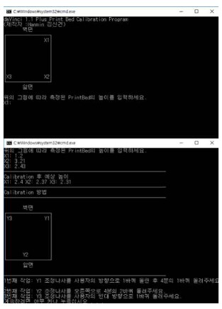

# 3d-printer-calibration-program
daVinci 1.1 plus 3D priter calibration c++ cli program (created at 2017)

 
    
    
    
    
    
    

## Abstract
본인은 학교 3D Printer 방과 후 수업을 진행하던 중, 3D Printer Calibration 과정에 대한 불편함을 가지게 되었다. 그리고 Calibration을 수동으로 진행하고 감으로 맞추는 것이 비효율적이라고 생각하게 되었다. 이를 계기로 3D Printer Calibration 프로그램을 제작하고자 하였다. 먼저, 3D Printer 방과 후 수업에서 사용하던 da Vinci 1.1 Plus 의 조정나사와 위치 측정 센서에 대해서 알아본 뒤, 간단한 삼각비의 원리를 이용해 Calibration 계산을 만들었고 이를 이용해 프로그램을 제작하였다. 그 후, 모든 3D Printer의 Calibrtion 프로그램을 제작하고자 조정나사와 위치 측정 센서의 위치와 그 위치들의 집합에 대한 일반화를 하였고 조정 나사의 위치에 따른 명령어의 집합을 일반화하였다. 일반화된 정보를 이용해 3D Calibration program을 제작하고자 했으나 3D Printer들이 사용하는 높이의 단위와 Calibration 완료 조건이 다르다는 점에 의해 Calibration Program의 일반화 과정까지 진행하였다. 이 연구를 통해서, 3D Printer Print Bed Calibration 과정에 편의성을 가져올 수 있었고 3D Printer 교육에 있어서 교사와 학생 모두에게 편의성을 가져올 수 있을 것으로 보인다

## example

## author
shinkeonkim